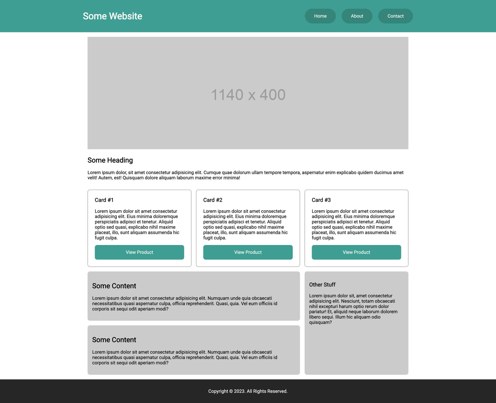
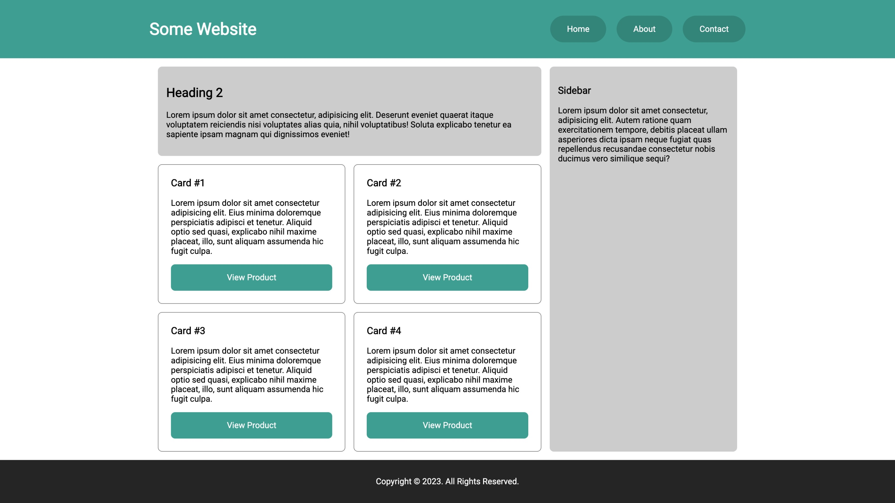
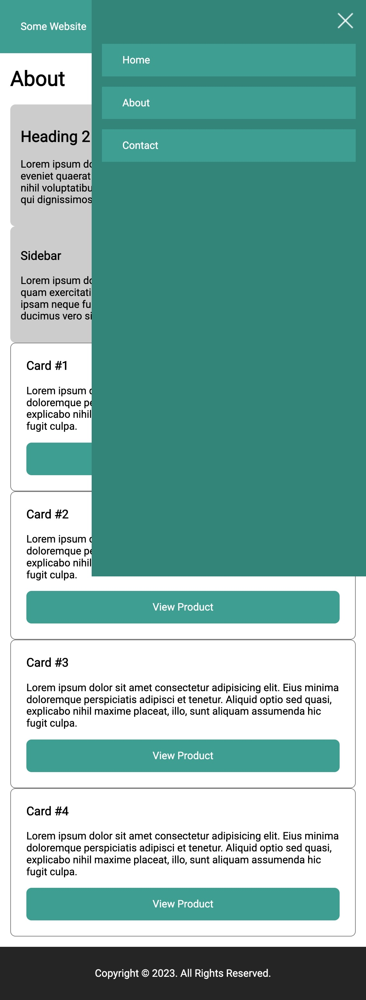

# Mobile Optimization Exercise

In this repo, you will see some HTML and CSS files. There are some generic theme styles provided for you. However, the website doesn't really look all that great on mobile and desktop screens.

Utilize media queries to make the webpages responsive with a mobile navigation.

## Desktop Homepage

## Desktop About Page

## Mobile Navigation
